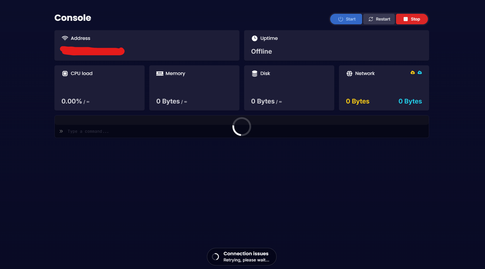

Sometimes, our game panel's console may experience an issue. If we have not logged anything on our status page this could your cache on the website.

If you are experiencing this issue. The console page could look like this:

To fix this issue, please do one of the following - this will perform a hard refresh on the website and clear the cache.
- Google Chrome or Firefox on Windows: Press and hold `Ctrl` and then press `F5` 
- Google Chrome or Firefox on Mac: Press and hold `Cmd` and `Shift`, then press `R`

If this issue still happening. Please open and [ticket](https://nodebyte.host/contact.php) and let us know what hosting plan you are on for us to be able to fix it as soon as possible. 

